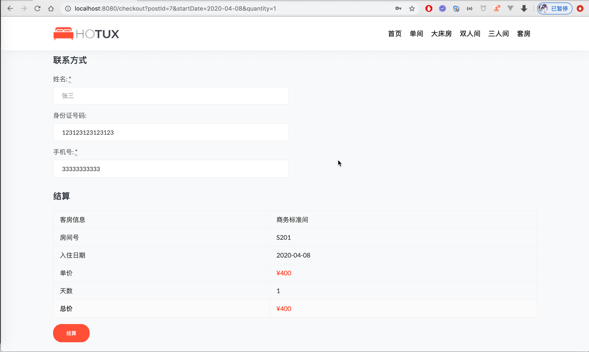

# SpringBoot酒店管理系统
基于SpringBoot实现的酒店管理系统，包括三种角色：管理员、酒店工作人员、客户。
- 管理员功能：客房管理、客房类型管理、酒店工作人员管理、其他所有权限
- 酒店工作人员功能：客户管理、客房浏览查询、预定客房、查看所有订单列表、财务管理
- 客户功能：注册、登录、找回密码、客房浏览查询、预定客房、查看自己订单列表

详细介绍：[https://liuyanzhao.com/10308.html](https://liuyanzhao.com/10308.html)  
预览地址：[https://hotel.liuyanzhao.com](https://hotel.liuyanzhao.com)

## 技术组成
- SpringBoot
- MyBatis
- Shiro
- Thymeleaf
- Bootstrap + jQuery

## 预览

## 联系方式
需要提供部署或讲解服务，可以联系我
微信：847064370
